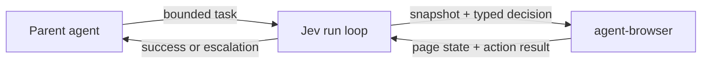

# jev-agent-browser

[](https://www.npmjs.com/package/jev-agent-browser) [](LICENSE)

> Fast, bounded browser execution for parent agents — powered by [Jev](https://typesafe.ai/) and [`agent-browser`](https://github.com/vercel-labs/agent-browser).

Give a parent agent a bounded browser task. Jev chooses the next typed action. `agent-browser` executes it. Ambiguity, repetition, or a stuck state becomes a structured handoff back to the parent.


A real 17-second, read-only walkthrough: Tasks → Text Classification → Most downloads → PyTorch → `ProsusAI/finbert` → back.

[Watch the full MP4 demo](https://github.com/forvela/jev-agent-browser/blob/main/media/huggingface-filter-demo.mp4) · [Open the original WebM recording](https://github.com/forvela/jev-agent-browser/blob/main/media/huggingface-filter-demo.webm)

## Quick start

```bash
npm install -g agent-browser
npm install -g jev-agent-browser
export TYPESAFE_API_KEY=...

jev \
  --url https://huggingface.co/models \
  --goal 'Open Tasks and select Text Classification' \
  --max-steps 6
```

Or run the CLI without a global Jev install:

```bash
npx --package jev-agent-browser jev --help
```

`agent-browser` is an external peer tool; this package owns the decision loop and research tools, not the browser engine. API keys stay in environment variables; they are never part of the browser page or decision state.

### Persistent decision config

Jev loads `~/.config/jev/config.json` automatically for the normal browser loop. Keep routing defaults there, never the secret itself:

```json
{
  "decision": {
    "endpoint": "https://openrouter.ai/api/alpha/decisions",
    "apiKeyEnv": "OPENROUTER_API_KEY",
    "model": "~typesafe/jev-latest"
  },
  "pacing": {
    "actionDelayMs": 700
  },
  "maxSteps": 12
}
```

`actionDelayMs` is optional and defaults to `0`; it delays only between successful browser actions. Use `--action-delay 0` to override it for a single run. Configured `tools` are exposed to Jev as bounded `RUN_TOOL` choices; tool paths are resolved relative to the config file.

```json
{
  "tools": {
    "scroll_to_bottom": {
      "path": "/path/to/browser-strategies/linkedin/scroll-to-bottom.js",
      "description": "On a LinkedIn page, jump to the current feed bottom without opening links"
    }
  }
}
```

Use another file with `--config ./jev.config.json`, or set `JEV_CONFIG`. Inject the key separately, for example with `op run`:

```bash
op run --env-file=<(printf 'OPENROUTER_API_KEY=op://Private/ITEM/credential\\n') -- \
  jev --url https://example.com --goal 'Open the pricing page'
```

## What it does

- **Browser tasks** — navigate, click, type explicit values, select, scroll, wait, and stop safely.
- **Research** — collect bounded raw evidence from configured pages and browser tools.
- **Classification** — send one typed, profile-driven batch to Jev.
- **Agent orchestration** — stream JSONL events or return a structured handoff to the parent agent.

## Why this wrapper

- **Typed actions, not generated browser code.** Jev chooses from a small validated action set.
- **Real browser control.** Built on `agent-browser`, with CDP attach, auto-connect, sessions, pinning, and native browser options preserved.
- **Research-ready.** Raw evidence is collected before classification; enrichment happens only after keep rules.
- **Provider-flexible.** Uses the official TypeSafe SDK by default and can target compatible Decisions endpoints, including OpenRouter.
- **CLI and Node.js API.** Use it from a shell, or embed the same loop in another agent.

## Where it fits

`jev-agent-browser` is a delegated executor, not another full browser-planning agent:

1. A parent agent owns intent, permissions, and the bounded task.
2. Jev selects one typed operation and target from the current snapshot.
3. `agent-browser` performs the native browser action.
4. The loop returns success or escalates a structured state to the parent when the task is ambiguous, repetitive, or blocked.



This keeps Jev fast and local to execution while the parent remains responsible for reasoning and side effects.

## Common use cases

### Real-site walkthrough

```bash
jev --url https://huggingface.co/models \
  --goal 'Select Text Classification, sort by Most downloads, choose PyTorch, inspect ProsusAI/finbert, then go back and stop.' \
  --max-steps 12
```

### Attach to an existing Chrome tab

```bash
jev --attach --auto-connect --pin-tab \
  --goal 'Inspect the current page and report what is visible'
```

Use a known CDP endpoint with `--attach --cdp 9222`. Native `agent-browser` arguments pass through with repeatable `--browser-arg` flags.

### Run bounded research

```bash
jev --mode research \
  --config ./research.json \
  --attach --auto-connect --pin-tab \
  --jsonl --summary
```

Profiles define the classification dimensions, keep rules, follow-ups, and allowed tools. The core stays domain-neutral.

### Use it from Node.js

```js
import { runLoop } from 'jev-agent-browser';

// Pass an adapter for the externally installed agent-browser or another engine.
export async function run(browser) {
  const result = await runLoop({
    browser,
    apiKey: process.env.TYPESAFE_API_KEY,
    goal: 'Open the pricing page',
    maxSteps: 5,
  });
  console.log(result.status, result.reason);
}
```

`runLoop` accepts injected browser and decision seams, so tests and other Node agents can provide their own adapters.

## Compatible Decisions endpoints

TypeSafe AI is the default:

```text
https://api.typesafe.ai/v1/systemone
```

A compatible endpoint can be selected without changing the browser loop:

```json
{
  "decision": {
    "endpoint": "https://openrouter.ai/api/alpha/decisions",
    "apiKeyEnv": "OPENROUTER_API_KEY"
  }
}
```

Use `decision.transport: "fetch"` only when intentionally bypassing the SDK for a custom transport. The SDK's fetch implementation remains injectable for library callers.

## Performance

Fast by construction: Jev makes typed decisions, while `agent-browser` executes native browser commands directly. This wrapper adds orchestration, not a second browser engine or a generated-JavaScript layer.

See Jev's own benchmark and performance claims for model-level results. This project will publish reproducible wrapper benchmarks separately rather than mixing network latency, model latency, and browser time into one number.

## Safety boundaries

- Browser work is sequential and bounded by `--max-steps`.
- Stale refs, repeated actions, malformed decisions, and stuck states stop safely.
- Input values are supplied by the parent and resolved locally.
- Submit, register, apply, and similar commitment actions should remain behind parent or user confirmation.
- Classification requests omit contact fields from collected candidates; bounded browser observations may still contain page content and URLs sent to the Decisions API.

## More

- [Full agent-facing skill](skills/core.md)
- [Profiles](profiles/)

## License

[MIT](LICENSE)
